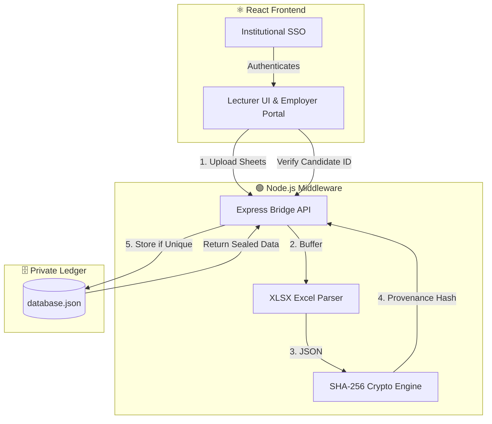

<p align="center">
  
</p>

<p align="center">
  
</p>

<div align="center">

  [](#)
  [](#)
  [](#)
  [](#)

</div>

# 🎓 Grading DApp - Component 03 (Silent Bridge)

## 🌟 Overview
The **Grading DApp** is a secure, decentralized application built as part of a Comprehensive Design and Analysis Project (Research Project R26-SE-011). It ensures the integrity, non-repudiation, and secure verification of student grades. 

The project has transitioned from its initial MVP (Phase 2) to more advanced developments, integrating comprehensive data extraction, cryptographic hashing, and enterprise-grade authentication.

## 🏗️ System Architecture



The application is logically divided into three primary components, all located under `component-03-silent-bridge`:

1. 💻 **Frontend (`/frontend`)**
   - **Tech Stack**: React, Vite, Tailwind CSS, Axios, Ethers.js
   - **Features**: 
     - User interface for lecturers to securely upload grading sheets.
     - Employer Verification Portal.
     - **Authentication**: Fully integrated with **Institutional SSO** to manage secure academic user login and session management.

2. ⚙️ **Middleware (`/middleware`)**
   - **Tech Stack**: Node.js, Express.js, Crypto-JS, Multer, XLSX
   - **Features**:
     - Acts as the "Silent Bridge" between the frontend and the ledger.
     - Parses uploaded `.xlsx` files and standardizes schemas.
     - Generates **SHA-256 Provenance Hashes** for uploaded datasets to maintain integrity.
     - Identifies and rejects duplicate payloads based on hash matching.

3. 🔒 **Private Ledger (`/private_ledger`)**
   - **Storage**: JSON-based simulated ledger (`database.json`)
   - **Features**: 
     - Immutable, append-only storage for cryptographic provenance records.
     - Stores module codes, uploader identities, and anchored grading data.

## ✨ Key Features
- **🛡️ Institutional SSO Integration**: Secure, seamless identity management tailored for academic environments.
- **🔐 Cryptographic Integrity**: Data is anchored using SHA-256 hashes, ensuring records cannot be tampered with once submitted.
- **🚫 Duplicate Prevention**: Before saving, the ledger verifies if the exact cryptographic hash already exists.
- **✅ Verification Portal**: Exposes an endpoint (`/api/verify/:studentId`) to retrieve and verify candidate grades against cryptographic records.

## 🚀 Getting Started

### 📋 Prerequisites
- Node.js (v18 or higher recommended)
- npm or yarn

### 1️⃣ Running the Middleware
Open a terminal and navigate to the middleware directory:
```bash
cd component-03-silent-bridge/middleware
npm install
node src/server.js
```
The server will start at `http://localhost:5000`.

### 2️⃣ Running the Frontend
Open a new terminal and navigate to the frontend directory:
```bash
cd component-03-silent-bridge/frontend
npm install
npm run dev
```
Access the application via the local Vite development server (usually `http://localhost:5173`).

## 🔌 API Endpoints

### `POST /api/ingest`
- **Description**: Ingests an Excel grading sheet, hashes the contents, and commits it to the private ledger.
- **Payload**: `multipart/form-data` containing the `gradingSheet` file, `moduleCode`, and `uploader`.

### `GET /api/verify/:studentId`
- **Description**: Verifies a specific student's grading records.
- **Response**: Returns cryptographically sealed grading data corresponding to the requested candidate ID.

## 🤝 Contributors

### 👩‍💻 Nithika
- **Role**: Core Developer (Component 03: Silent Bridge)
- **GitHub**: [@NIKKAvRULZ](https://github.com/NIKKAvRULZ)
- **Contributions**:
  - Developed the **Node.js Middleware** for parsing, cryptographic hashing, and data standardization.
  - Built the **React Vite Frontend**, integrating **Institutional SSO** for robust authentication.
  - Implemented the **Simulated Private Ledger** with duplicate-prevention constraints.

**Research Group: R26-SE-011** (Comprehensive Design and Analysis Project)
