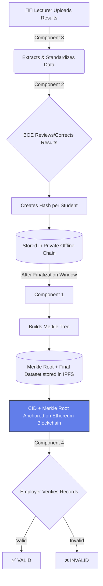

<div align="center">
  

  <!-- Animated typing effect -->
  

  <br />

  [](#)
  [](#)
  [](#)
  [](#)
  [](#)
</div>

<h1 align="center">🎓 Blockchain-Based Transparent and Secure Academic Grading Using Decentralized Verification</h1>

---

## 🎯 The Real-World Problem

The problem is **NOT** that "lecturers are changing marks." 

The *real problem* is:
> **Students can fake or modify result sheets when applying for jobs or higher studies, and employers currently have no easy way to verify whether the submitted academic results are genuine.**

### Current Limitations:
- ❌ Traditional university systems are centralized.
- ❌ Verification depends fully on university databases.
- ❌ Employers must manually contact universities for confirmation.
- ❌ Fake transcripts and edited PDFs are increasing.
- ❌ There is no cryptographic proof for academic records.

---

## ✅ Our Main Solution

We are building a **Blockchain-based academic grading verification system** that allows:
- **Universities** to securely process results.
- **Employers/Students** to verify authenticity independently.
- **Academic records** to become tamper-resistant.
- **Verification** without trusting PDFs/screenshots.

### 🛠 Technologies Used
- **SHA-256 Hashing**: For data integrity.
- **Merkle Trees**: For dataset compilation and proof.
- **Private Offline Blockchain**: For temporary internal institutional records.
- **IPFS (Pinata)**: Decentralized storage for finalized datasets.
- **Ethereum Blockchain**: For immutable anchoring of proofs.
- **Zero-Knowledge Proofs (ZKP)**: For privacy-preserving verification.

---

## 🧩 Overall System Flow



---

## 🏗 System Components

<details>
<summary><b>🧩 COMPONENT 3 — DATA INGESTION LAYER</b></summary>

### 🎯 Purpose
Acts as the secure "front door" of the system. It handles manual lecturer uploads, creates the initial secure ledger blocks, verifies uploads, and standardizes records for Component 2.

#### ✅ The Ingestion Method
The system relies on lecturers *manually* uploading Excel sheets, CSV files, or LMS exports. It does not use direct automated LMS extraction, ensuring a deliberate and verifiable submission process.

#### ✅ Addressing Schema Heterogeneity
Unlike simple systems that just grab a final grade, Component 3 dynamically parses complex rubrics. Using `SheetJS`, it grabs *all* grading columns (e.g., Assignment 1, Midterm, Final) and packages them into a comprehensive `gradingData` object. It also successfully removes unnecessary PII (Personally Identifiable Information) data to maintain privacy.

#### ✅ Features Completed
- 🔐 Lecturer login (Mock SSO)
- 📄 Manual Excel/CSV upload handling
- ⚙️ Dynamic parsing & schema heterogeneity resolution using SheetJS
- 🗑 Removing PII / unnecessary data for privacy
- 🔑 Initial SHA-256 hashing engine setup
- 🛡 Duplicate prevention & validation
- 🖥 **Verification Portal UI**: Drives the React dashboard that employers will eventually use to query the system (Feature 1 of Component 4).

#### ✅ Output & Handoff to Component 2
Sends deeply standardized student records to Component 2. While the high-level architecture distills this down to `Student ID + Module Code + Final Grade` for hashing, Component 3 actually passes the fully rich dataset:
```json
{
  "studentId": "IT001",
  "moduleCode": "SE4010",
  "gradingData": {
    "assignment1": 85,
    "midterm": 78,
    "final": 90,
    "totalGrade": "A"
  }
}
```
*From here, Component 2 handles Appeals/Corrections and generates the strict hash for the Merkle Tree.*
</details>

<details>
<summary><b>🧩 COMPONENT 2 — BOE REVIEW & CORRECTION LAYER</b></summary>

### 🎯 Purpose
Allows official academic corrections safely by the Board of Examiners (BOE).

#### ✅ Why This Exists
Results sometimes need moderation, appeal corrections, or calculation fixes. Normal systems overwrite old results. This component keeps version history, audit logs, and correction tracking.

#### ✅ Workflow
`BOE Login` ➔ `Search Student` ➔ `Edit Result` ➔ `Save Correction` ➔ `Version Updated` ➔ `Hash Generated`

#### ⚠️ Important Design Decision
Component 2 hashes ONLY:
`Student ID + Module Code + Final Grade` (e.g., `IT001 + SE4010 + A`). 
*Not timestamps, comments, or lecturer names.* This ensures Component 4 can regenerate the SAME hash during verification.

#### 🔒 Private Offline Blockchain
Component 2 stores all student hashes in an internal institutional chain. This is a temporary secure ledger containing per-student hashes during the correction period.

#### ⏳ Two-Week Finalization Window
During this time, corrections are allowed and hashes are updated. After the deadline, the dataset becomes **FINALIZED**.
</details>

<details>
<summary><b>🧩 COMPONENT 1 — BLOCKCHAIN PROOF LAYER</b></summary>

### 🎯 Purpose
Creates the FINAL tamper-proof system.

#### ✅ Process
1. **Build Merkle Tree**: Combine all finalized hashes from Component 2.
2. **Generate Merkle Root**: Represents the ENTIRE dataset. If ANY student grade changes, the Merkle Root changes completely.
3. **Create Final Dataset JSON**:
    ```json
    [
      {
        "studentId": "IT001",
        "moduleCode": "SE4010",
        "grade": "A+",
        "hash": "zzz999"
      }
    ]
    ```
4. **Store Dataset in IPFS**: Upload finalized dataset using Pinata. IPFS returns a unique CID (Content Identifier).
5. **Blockchain Anchoring**: Store the **CID** and **Merkle Root** on Ethereum. (We don't store full student records to save blockchain storage costs).
</details>

<details open>
<summary><b>🧩 COMPONENT 4 — VERIFICATION LAYER</b></summary>

### 🎯 Purpose
Allows employers/students to verify authenticity. 
*Note: Component 4 DOES NOT compare with CID directly. CID is only used to retrieve the FINAL dataset from IPFS.*

#### 🏢 Employer Portal Features
1. **View Results**: Employer inputs `Student ID` and sees the grades.
2. **Verify Authenticity**: Employer inputs `Student ID`, `Module Code`, and `Grade`.

#### ✅ Verification Workflow
1. **Generate Verification Hash**: e.g., `hash(IT001 + SE4010 + A+) -> zzz999`
2. **Retrieve Final Dataset**: From IPFS using CID anchored on the blockchain.
3. **Find Stored Student Hash**: Look up the student in the downloaded JSON.
4. **Compare Hashes**:
   - `generatedHash == storedHash` ➔ **✅ VALID**
   - `generatedHash != storedHash` ➔ **❌ INVALID**
5. **Merkle Proof Verification**: Verifies that this student hash belongs to the official Merkle Root stored on the blockchain, proving it's officially part of the finalized university dataset.

> **💡 Why VALID/INVALID makes sense:** The employer is verifying whether the *STUDENT'S CLAIM* matches the officially finalized university record.
</details>

---

## 🔥 Final System Benefits
- ✅ Prevents fake result sheets
- ✅ Prevents transcript tampering
- ✅ Independent employer verification
- ✅ Transparent academic proof system
- ✅ Reduced blockchain storage cost
- ✅ Scalable architecture
- ✅ Keeps student data private
- ✅ Tamper detection using cryptography

---

## 📈 Current Status of Components

| Component | Status |
| :--- | :--- |
| **Component 1** | 🟢 Hashing + Merkle + IPFS completed |
| **Component 2** | 🟢 BOE APIs + Versioning + Hashing completed |
| **Component 3** | 🟢 Upload/parser/portal completed |
| **Component 4** | 🟢 ZKP verification backend completed |

---

## 🌿 Repository Branch Structure (Implementation History)

The development of this project was modularized into distinct branches to isolate component logic and ensure parallel development. Below is the breakdown of the actual implemented features tracked across our Git branches:

### 🟩 Component 1: Blockchain Proof Layer
- `feature/component-01-hashing` - Core SHA-256 data hashing logic.
- `feature/component-01-merkle-tree` - Merkle Tree construction and Root generation.
- `feature/component-01-ipfs` - Pinata IPFS integration and CID management.

### 🟦 Component 2: BOE Review & Correction Layer
- `feature/component-02-backend-setup` - Core API setup for the Board of Examiners.
- `feature/component-02-frontend` - BOE review interface and student lookup.
- `feature/component-02-core-revision` - Modification handlers and result overrides.
- `feature/component-02-audit-version` - Version history tracking and audit logs.
- `feature/component-02-deadline-hash` - Two-week finalization logic and temporary hash anchoring.

### 🟪 Component 3: Data Ingestion Layer
- `feature/component-03-frontend-setup` - Initial lecturer portal UI.
- `feature/component-03-backend-setup` - Lecturer authentication and upload API.
- `feature/component-03-extraction-engine` - Excel/CSV parsing and LMS format standardization.
- `feature/component-03-hashing-ledger` - Duplicate prevention and initial hashing.
- `feature/component-03-verification-portal` - Verification portal UI setup.
- `component-03-silent-bridge` - Final integration point for the ingestion phase.

### 🟧 Component 4: Verification Layer
- `component4-zkp-formal-verification` - Zero-Knowledge Proof (ZKP) logic and final employer verification mechanisms.

---

## 🔮 Future Work
- 🚀 Ethereum smart contract deployment.
- 🔌 Full API integration between components.
- 🧪 End-to-end testing with real university datasets.
- 🖥 Final employer verification portal.
- ⛓️ Public blockchain anchoring.
- 🤖 Automated Merkle proof generation.

<br/>
<div align="center">
  
</div>
